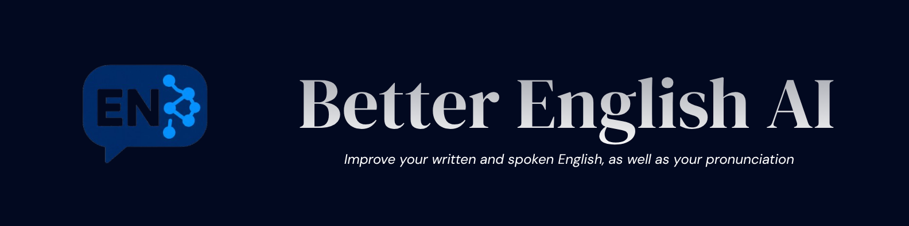

# Better English AI

Better English AI helps learners practise English through conversation.
Speak with an AI partner and receive feedback on what you say.
Explore pronunciation practice to work on spoken English.
Use writing practice to improve grammar, spelling, and word choice.
Review corrections and explanations alongside your writing.
Listen to spoken replies during voice conversations.
In voice and writing practice, enter a topic or choose a suggestion and select **Let AI start**.
Your English partner opens with a question; reply by speaking or writing to continue on that topic.
Voice openings include playable audio when speech generation is available. You can also start the conversation yourself.
Select **New conversation** to clear the topic and messages and cancel any pending opening request.
Set up the application locally and practise at your own pace.
Speech recognition, pronunciation analysis, and voice generation run locally on CPU.
Conversation and corrections use the GLM API.

---

## Quickstart

### Install

Requires Python 3.12+, uv, Node.js 22.12+, npm, ffmpeg, and eSpeak NG. On Debian or Ubuntu, the install script can install ffmpeg and eSpeak NG using apt.

```bash
./scripts/install.sh
```

### Run

Start the backend and frontend in separate terminals:

```bash
./scripts/dev-backend.sh
```

```bash
./scripts/dev-frontend.sh
```

Open the local URL printed by the frontend, then visit **Setup** to save your GLM API key and download the speech models. Model downloads require internet access and several gigabytes of disk space.
